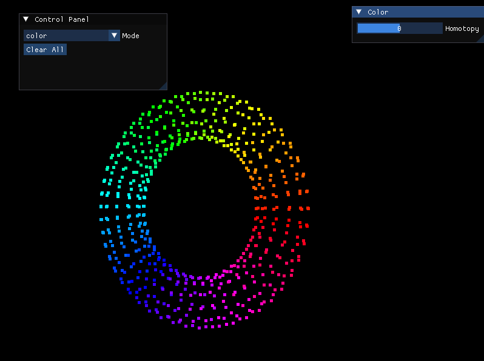
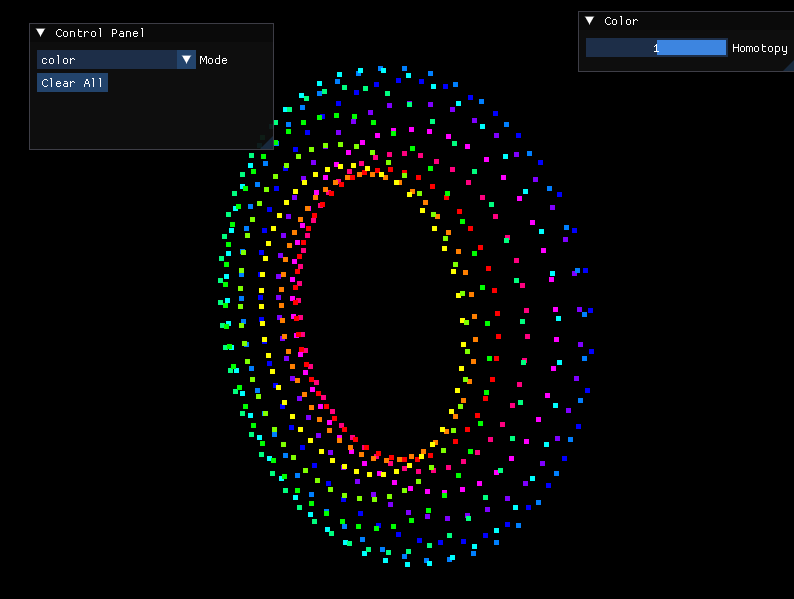
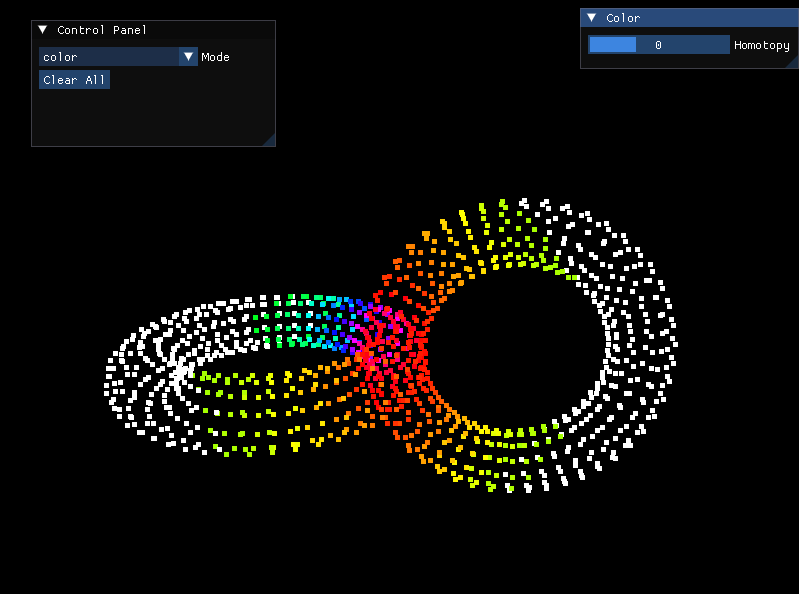
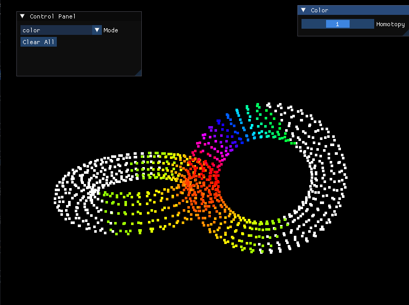
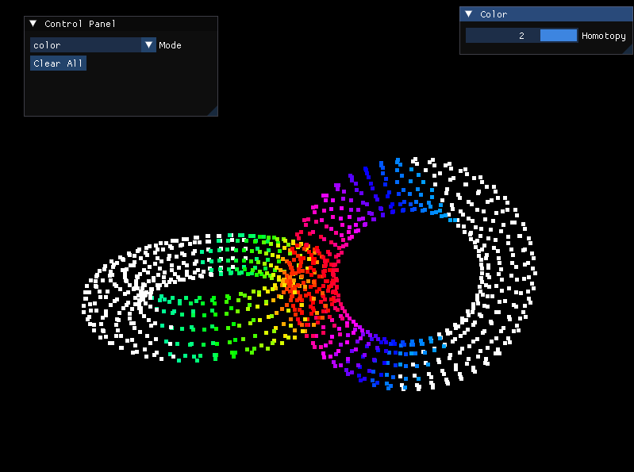
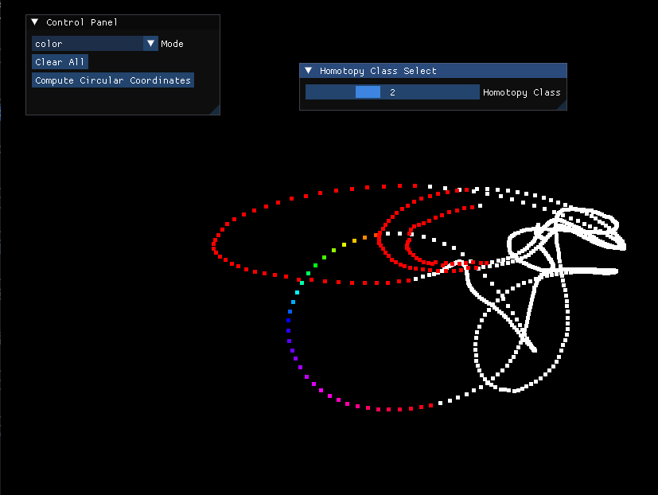
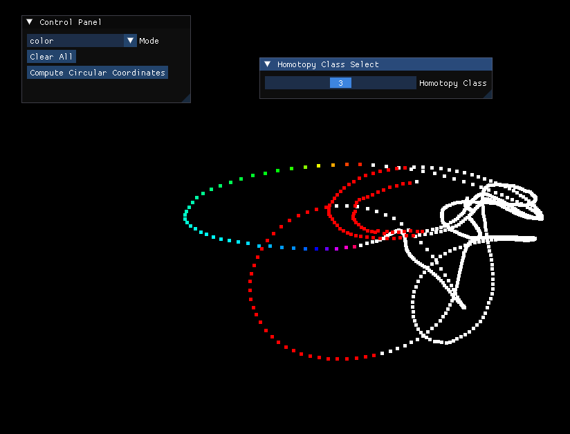

# Circular Coordinate Computation

This is the course project for CS-6170 Computational Topology. The name of this repository could be misleading: the project is not meant to be (and will not be) an implementation of many topological data analysis algorithms. Instead, it includes only the implementation for the following two papers:

1. [Persistent Cohomology and Circular Coordinates](https://link.springer.com/article/10.1007/s00454-011-9344-x)
2. [Branching and Circular Features in High Dimensional Data](https://dl.acm.org/doi/10.1109/TVCG.2011.177)

## Build

On the root of this project:

```shell
mkdir build
cd build
cmake .. -DCMAKE_BUILD_TYPE=Release -DBUILD_TESTS=True
make
```

### Dependencies

* [spdlog](https://github.com/gabime/spdlog)
* [CGAL](https://www.cgal.org/): A version >= 4.11.0 is required.
* [GUDHI](https://gudhi.inria.fr/)
* [Eigen3](https://eigen.tuxfamily.org/index.php?title=Main_Page): A version == 3.4.0 is required.
* [IGL](https://libigl.github.io/): The building process will download `IGL` for the users automatically.

A short notice on how the dependencies are used:

* `CGAL` and `GUDHI` are used exclusively for the generation of Rips complex.
* `Eigen3` is used for solving the least square problem aroused in the lifting step.
* `IGL` is used for reading OBJ files and fast queries on nearby points (in the future).

## Run

Below are two examples for visualizing 3d models and high-dimensional models respectively.

For 3d models: On the root of the `build` directory:

```shell
./test/3d-model torus.obj
```


For higher dimensional models: On the root of the `build` directory:

```shell
./test/high-dim-model B17.c3d.eig
```


## Example Results

Low dimensional example 1: The torus. Here we visualize the two looping structures of the torus, one corresponds to the loop around the hole and one corresponds to the loop around the solid part of the loop.





Low dimensional example 2: THe 2-torous. Here we visualize the branching structures near the center of the 2-torus. There are 4 branches, and therefore three homotopy class after we glue the 'away'-end of the branches together.







High dimensional example: This one comes from the real-life example: The [OSU motion capture dataset](https://accad.osu.edu/research/motion-lab/mocap-system-and-data). Here I use motion B17 of female walking, which corresponds roughly to walk-hop-walk. After filtering out the nan numbers, I got 754 frames each containing 32 3D points. Then I simply treat them as 754 points in
a 96 dimensional space. As we can see below, the misleeding intersection points in low dimensional space after dimension reduction turn out to be a non-intersection in high dimensional space, and this can be visualized by our tool.





